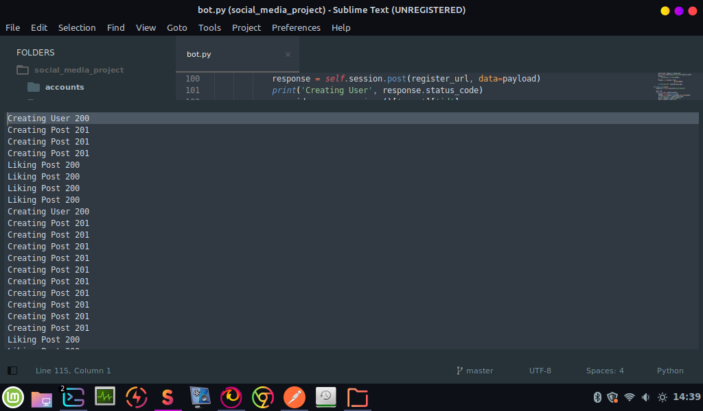

# Social Media Bot
A bot that register users and creates random posts based on user preferences


### Installation and Usage

Open cmd in the project's directory and type:
```
pip install -r requirements.txt

```
Create a config.ini file and assign a number to each of these variables.
Here is an example:

```
[preferences]
number_of_users = 10
max_posts_per_user = 12
max_likes_per_user = 14
```

Then run the script bot.py.
Make sure you create a bot object from Bot class and call the register_users function
Example:

```
bot = Bot()
bot.register_users()
```
